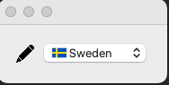

# Flag Picker



Small app showing the usage of dynamically generated resource file and compiling it with qmacro

## install 

```shell
python setup.py install  # install PysideSetupMacro

cd examples/scandinavian_flag_picker
python setup.py install
```