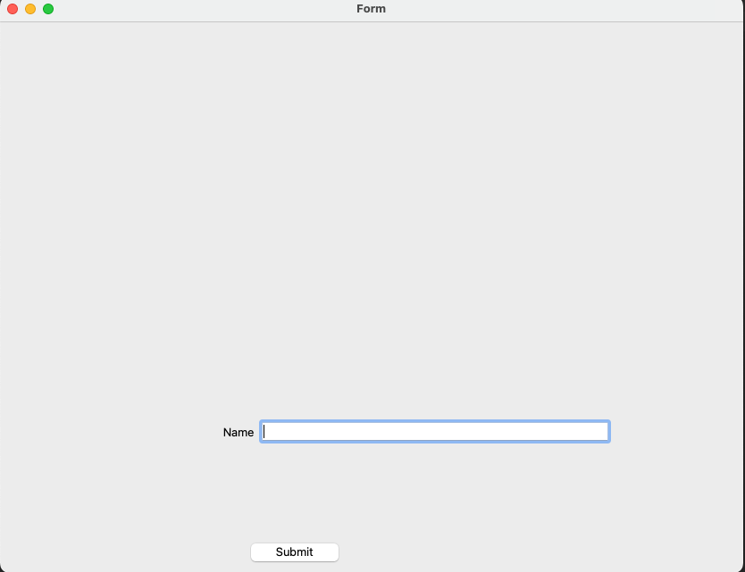

# Ui File



Small app showing the usage of dynamically converting .ui file to python module at build time.

## install
```shell
python setup.py install  # install PysideSetupMacro

cd examples/ui_file_app
python setup.py install
```